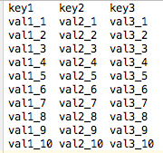
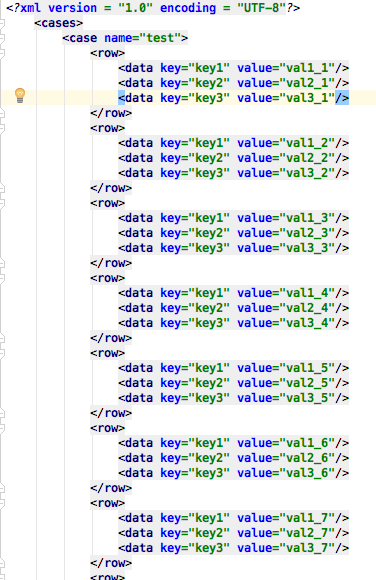
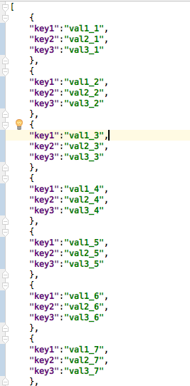
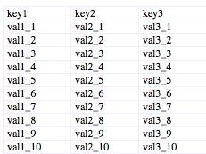

# FileTools


### The tool is used to transform data of different type file.

* txt
* xml
* json
* xls
* xlsx

### The file style is following:

> txt file style   
>
> 
>
> xml file style   
>
> 
>
> json file style   
>
> 
>
> xls file style   
>
> 
>
> xlsx file style   
>
> 
>

### The PO class field to MySql table structure：

```
public class PoTest{
    private Integer id;
    private String name;
    private Integer age;
    private Long createTime;
}
          | |
          | |
          | |
          \  /
           \/
create table po_test (
id	BIGINT	not null	primary key,
name	VARCHAR	null	comment '',
age	BIGINT	null	comment '',
create_time	BIGINT	null	comment '',

);
```

